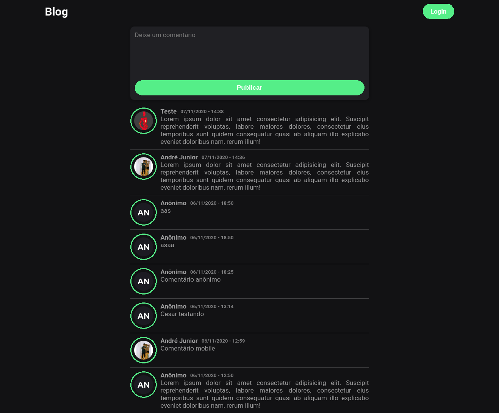

  <a href="#-tecnologias">Tecnologias</a>&nbsp;&nbsp;&nbsp;|&nbsp;&nbsp;&nbsp;
  <a href="#-projeto">Projeto</a>&nbsp;&nbsp;&nbsp;

 

  

## 🚀 Tecnologias

Esse projeto foi desenvolvido com as seguintes tecnologias:

- [PHP](https://www.php.net)
- CSS
- [Amazon RDS](https://aws.amazon.com/pt/rds//)

## 💻 Projeto

O Forum é uma aplicação feita durante a aula de Desenvolvimento para Servidores.
Utilizando a linguagem de programação PHP, para estilização o CSS e 
a Amazon RDS fornecendo o serviço de banco de dados relacional na nuvem.

---

Feito by André Junior :wave: [portifólio](https://andrejr.dev)